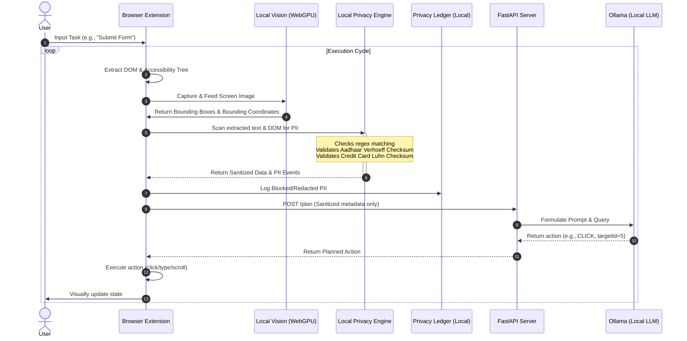

# Browser Agent Flow & Pipeline Documentation

This document describes the complete flow of the privacy-preserving, on-device visual perception browser agent system. It outlines the client-server interaction, local validation processes, and data routing.

---

## 1. System Overview

The system consists of two major components:
1. **Client-Side Extension (React + WXT + Transformers.js):** Runs entirely within the user's browser. It extracts the DOM, runs the vision model via WebGPU, applies local PII filters, and logs operations to a local privacy ledger.
2. **Server-Side Planner (FastAPI + Ollama):** Receives **only anonymized UI metadata** (no raw screenshots, no raw DOM, no PII). It uses a local LLM to plan the next actions (Click, Type, Scroll, Complete) and returns them to the client.



---

## 2. Step-by-Step Pipeline Flow

### Step 1: Task Initialization
* The user opens the extension panel and inputs a goal (e.g., *"Fill out this application form"*).
* The extension initializes a session ID and sets up the execution loop.

### Step 2: Screen Perception (DOM & Vision)
* **Accessibility Tree Extraction:** The content script extracts elements from the active tab. It records attributes like tags, ARIA roles, names, and relative coordinates.
* **WebGPU-Accelerated Vision Grounding:** 
  * The page captures a snapshot of the viewport.
  * The image is processed on-device by `Florence-2-base-ft` using ONNX Runtime Web.
  * Interactive elements are mapped using a Set-of-Marks (SoM) overlay containing numbered bounding boxes.

### Step 3: Local Privacy Filter (PII Redaction)
Before *any* data is sent over the network:
* **Regex Engine:** Text inputs, label values, and placeholders are matched against templates for Aadhaar, PAN, Credit Cards, Emails, and Phone Numbers.
* **Cryptographic Checksum Verification:**
  * **Aadhaar:** Matches are validated using the Verhoeff algorithm to filter out random 12-digit numbers.
  * **Credit/Debit Cards:** Matches are validated using Luhn's algorithm.
* **Redaction/Obfuscation:**
  * Validated PII values are redacted or masked (e.g., `1234 5678 1234` becomes `1234 XXX XXX`).
  * Password fields are fully blacked out.
  * Face detection blurs image areas before displaying visual highlights.

### Step 4: Auditing (Privacy Ledger)
* Every detection, redaction, and sanitization event is logged in the **Privacy Ledger**.
* The ledger runs inside the extension background process, providing a real-time audit log of exactly what data was modified or blocked.

### Step 5: Sanitized Metadata Egress
* The client builds a lightweight payload containing:
  - Anonymized accessibility tree
  - Bounding box coordinates of interactive elements (SoM IDs)
  - Redacted text labels
  - Cryptographic checksum of the payload to detect tampering
* This payload is sent to `POST http://localhost:8000/plan`.

### Step 6: Action Planning & Execution
* The FastAPI server parses the sanitized payload.
* The server uses a prompt template containing only the anonymized structure and task description to ask Ollama (`qwen2.5:1.5b`) for the next step.
* Ollama returns a JSON action payload (e.g., `{"type": "TYPE", "targetId": 12, "text": "Redacted User Input"}`).
* The content script receives the action and uses a self-healing DOM executor to click or type into the specified target element on the webpage.
* The loop repeats until the planner returns a `COMPLETE` action.

---

## 3. Data Payloads

### Before Sanitization (Local State only)
```json
{
  "url": "https://gov-portal.in/apply",
  "interactiveElements": [
    {
      "id": 1,
      "label": "Aadhaar Card Number",
      "value": "3645 8927 4930" 
    }
  ]
}
```

### Outbound Sanitized Payload (Sent to FastAPI)
```json
{
  "url": "https://gov-portal.in/apply",
  "interactiveElements": [
    {
      "id": 1,
      "label": "Aadhaar Card Number",
      "value": "3645 XXX XXX" 
    }
  ],
  "checksum": "d5a2f8b5..."
}
```
